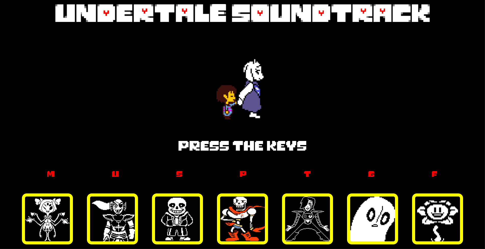

# UnderTale SoundTrack

A simple browser-based Undertale-themed soundtrack player built with HTML, CSS and vanilla JavaScript. Click character panels or press the associated keys to play tracks.

**Features:**
- Clickable character tiles that play music.
- Keyboard shortcuts: M, U, S, P, T, G, F.
- Global `Stop` button to pause and reset playback.
- Single-audio playback: starting a new track stops the previous one.

**License**
Use or modify for personal projects. Respect Undertale's original copyright when sharing.
